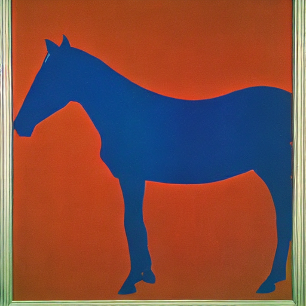

# simple stable diffusion 🌄

get stable diffusion running in <10 minutes in colab:

this notebook contains:
1. the absolute minimum code needed to generate images with stable diffusion
2. tips for writing good prompts

currently this notebook only works on colab and not when run locally; a pr changing this would be appreciated

## what is stable diffusion?

[stable diffusion](https://github.com/CompVis/stable-diffusion) is a text-to-image model similar to [dall·e 2](https://openai.com/dall-e-2/); that is, it inputs a text description and uses ai to output a matching image

for instance, the following image was generated with stable diffusion using the prompt `gallant thoroughbred, a surrealist painting by Andy Warhol, mystical, ominous`:

it is generally considered to be of similar quality to dall·e, but is:
1. more computationally efficient
2. available to the public (ie can be run locally, not just through openai's playground)

a more in-depth explanation of stable diffusion's architecture can be found in [this notebook](https://colab.research.google.com/github/huggingface/notebooks/blob/main/diffusers/stable_diffusion.ipynb) or [here](https://www.louisbouchard.ai/latent-diffusion-models/)
